# Markdown Simplifié : Guide pour les étudiants en BTS

## Table des Matières

- [**Partie GIT : Cours**](#partie-git-cours)
  - [Git (Software)](#git-software)
  - [Pousser un projet sur Git](#pousser-un-projet-sur-git)
  - [Features sur votre IDE](#features-sur-votre-ide)
  - [Définitions](#définition)
    - [Qu'est-ce qu'un FORK ?](#quest-ce-quun-fork-)
    - [Qu'est-ce qu'une variable ?](#quest-ce-quune-variable-)
    - [Qu'est-ce qu'un objet ?](#quest-ce-quun-objet-)
    - [Qu'est-ce qu'un réel à virgule flottante ?](#quest-ce-quun-reel-a-virgule-flottante-)
    - [Qu'est-ce qu'un entier ?](#quest-ce-quun-entier-)
    - [Que veut dire concaténation ?](#que-veut-dire-concaténation-)
    - [Qu'est-ce qu'un tableau ?](#quest-ce-quun-tableau-)
    - [Qu'est-ce qu'un paramètre ?](#quest-ce-quun-paramètre-)
    - [Fonction & Procédure ?](#fonction--procédure-)
    - [Qu'est-ce que le timestamp ?](#quest-ce-que-le-timestamp-)
  - [Procédure : Commencer à Coder en C#](#procédure--commencer-à-coder-en-c)
    - [Installer un Environnement de Développement Intégré (IDE)](#1-installer-un-environnement-de-développement-intégré-ide)
    - [Créer un Nouveau Projet](#2-créer-un-nouveau-projet)
    - [Écrire du Code C#](#3-écrire-du-code-c)
    - [Compiler et Exécuter](#4-compiler-et-exécuter)
  - [Les opérateurs en C#](#les-opérateurs-en-c)
  - [Instructions](#instructions)
    - ["le temps que" (while)](#le-temps-que-while)
      - ["pour" (for)](#pour-for)
    - ["répéter" (do-while)](#répéter-do-while)
    - [Conditionnelles `if` avec `else`](#conditionnelles-if-avec-else)

---

- [**Partie BDD : Cours**](#partie-bdd-cours)
  - [Définitions](#base-de-donnée-définition)
    - [Qu'est-ce qu'une Base de Donnée ?](#quest-ce-quune-base-de-donnée-)
    - [Qu'est-ce que Homebrew ?](#quest-ce-que-homebrew-)
    - [Que veut dire SGBDR ?](#que-veut-dire-sgbdr-)
    - [Que veut dire Cloner son projet GIT ?](#que-veut-dire-cloner-son-projet-git-)
    - [Qu'est-ce qu'un commit ?](#quest-ce-quun-commit-)
    - [Qu'est-ce qu'un push ?](#quest-ce-quun-push-)
    - [Qu'est-ce qu'un Schemas ?](#quest-ce-quun-schemas-)
    - [Qu'est-ce qu'une TABLE ?](#quest-ce-quune-table-)
    - [Qu'est-ce qu'un champ ?](#quest-ce-quun-champ-)
    - [Qu'est-ce qu'une occurrence ?](#quest-ce-quune-occurrence-)
    - [Qu'est-ce qu'une clé primaire ?](#quest-ce-quune-clé-primaire)
    - [Qu'est-ce qu'une clé étrangère ?](#quest-ce-quune-clé-étrangère)
    - [A quoi sert le ALTER TABLE ?](#alter-table)
  - [Installation de Homebrew](#installation-de-homebrew)
  - [Installation de PostgreSQL](#installation-de-postgresql)
  - [Gestion de base de données](#gestion-de-base-de-données)
    - [Installation PgAdmin](#installation-pgadmin)
    - [Installation de DBeaver](#installation-de-dbeaver)
    - [Configuration PgAdmin](#configuration-pgadmin)
    - [Configuration DBeaver](#configuration-dbeaver)

---

- [**Partie WEB : Cours**](#partie-web-cours)
  - [Qu'est-ce qu'une application web ?](#quest-ce-quune-application-web-)
  - [Définitions](#définitions)
    - [Quel est la différente entre le front-end et le back-end ?](#quel-est-la-différente-entre-le-front-end-et-le-back-end-)
      - [Front-end (côté client)](#front-end-côté-client-)
      - [Back-end (côté serveur)](#back-end-côté-serveur-)
    - [Qu'est-ce que le HTML ?](#quest-ce-que-php-)
    - [Qu'est-ce que le CSS ?](#quest-ce-que-html-)
    - [Qu'est-ce que le PHP ?](#quest-ce-que-css-)
    - [Qu'est-ce qu'une URL ?](#quest-ce-quune-url-)
    - [Qu'est-ce que Apache ?](#quest-ce-que-apache-)
    - [Qu'est-ce que PhpMyAdmin  ?](#quest-ce-que-phpmyadmin-)
  - [Gestion d'une application web](#gestion-dune-application-web)
    - [Installation de MAMP](#installation-de-mamp)
      - [Qu'est-ce que MAMP ?](#quest-ce-que-mamp-)
      - [Installation de MAMP](#installation-de-mamp-)
      - [Les répertoires importants de MAMP](#les-répertoires-importants-de-mamp)
    - [Configuration de MAMP](#configuration-de-mamp)
      - [Lancer MAMP Pro, vous devriez arrivez sur cette interface.](#lancer-mamp-pro-vous-devriez-arrivez-sur-cette-interface)
    - [Configuration de PhpMyAdmin](#configuration-de-phpmyadmin)
      - [Étape 1 : Installation de PhpMyAdmin](#étape-1-installation-de-phpmyadmin)
      - [Étape 2 : Qu'est-ce qu'on peut faire ?](#étape-2-quest-ce-quon-peut-faire-)

--- 

- [**Partie SQL avec DBeaver : TP1**](#partie-sql-avec-dbeaver-tp2)
  - [Base de donnée : Ordre SQL](./SQL/TP1/question1.sql)
  - [Exercice 1 : Création de table](#partie-sql-avec-dbeaver-tp2)
  - [Exercice 2 : Type INSERT, DELETE, UPDATE](#partie-sql-avec-dbeaver-tp2e)
  - [Exercice 3 : Clé étrangère](#partie-sql-avec-dbeaver-tp2)
  - [Exercice 4 : Type ALTER TABLE (Delete)](#partie-sql-avec-dbeaver-tp2)
  - [Exercice 5 : Type ALTER TABLE (Add)](#partie-sql-avec-dbeaver-tp2)
  - [Exercice 6 : Type ALTER TABLE (Destroy)](#partie-sql-avec-dbeaver-tp2)
  - [Exercice 7 : Type ALTER TABLE (Create)](#partie-sql-avec-dbeaver-tp2)


- [**Partie SQL avec DBeaver : TP1 (suite)**](#partie-sql-avec-dbeaver-tp1suite)
  - [Exercice 1 : Camions - NoImmatriculation](#partie-sql-avec-dbeaver-tp1suite)
  - [Exercice 2 : Déchets - Libellé](#partie-sql-avec-dbeaver-tp1suite)
  - [Exercice 3 : Types de déchets - Camion](#partie-sql-avec-dbeaver-tp1suite)
  - [Exercice 4 : Liste des camions - Verre](#partie-sql-avec-dbeaver-tp1suite)
  - [Exercice 5 : Liste des pesées - David](#partie-sql-avec-dbeaver-tp1suite)
  - [Exercice 6 : Pesée - 2017](#partie-sql-avec-dbeaver-tp1suite)
  - [Exercice 7 : Poids Max - 2017](#partie-sql-avec-dbeaver-tp1suite)
  - [Exercice 8 : Camions < 19T](#partie-sql-avec-dbeaver-tp1suite)
  - [Exercice 9 : Poids "Papiers-cartons" - SOLUTRI](#partie-sql-avec-dbeaver-tp1suite)
  - [Exercice 10 : Syndicat - Verre (Ordre alphabétique)](#partie-sql-avec-dbeaver-tp1suite)
  - [Exercice 11 : Poids déchets - syndicat/type de déchet](#partie-sql-avec-dbeaver-tp1suite)
  - [Exercice 12 : Type déchets - Pas Pesée](#partie-sql-avec-dbeaver-tp1suite)

<br>

---

<details id="partie-git-cours">
 <summary style="font-size: 25px; font-weight: bold; color: white;">Partie GIT : Cours</summary>

## Git (Software) <a id="git-software"></a>

Git est un gestionnaire de source qui permet d'envoyer des fichiers de manière très rapidement en l'espace de quelques seconde sur un serveur (gain de temps). C'est tout bonnement du texte où l'on peut voir les modifications apportées.

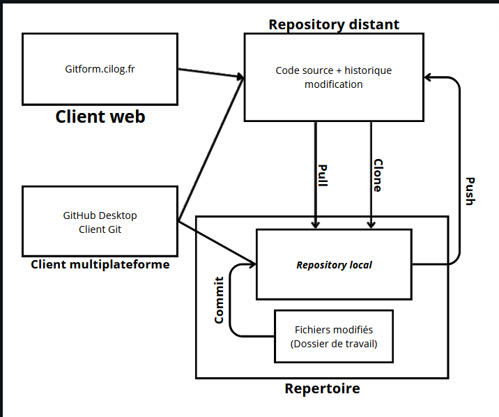

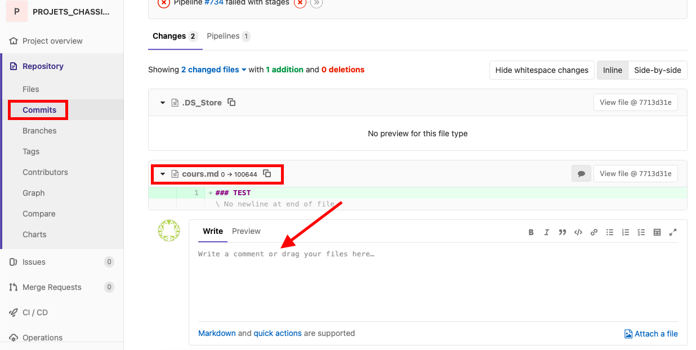

[Cliquez ici pour revenir au sommaire](#table-des-matières)

## Pousser un projet sur Git <a id="pousser-un-projet-sur-git"></a>

1. **Créez un référentiel (repository) Git** : Si vous n'avez pas encore de référentiel Git pour votre projet, vous pouvez en créer un sur une plateforme comme GitHub, GitLab, HerokuGit, ou en local sur votre machine. Pour créer un référentiel localement, utilisez la commande `git init` dans le répertoire de votre projet.

2. **Ajoutez et confirmez (commit) vos modifications** : Avant de pousser quoi que ce soit, assurez-vous d'ajouter et de confirmer vos modifications dans le référentiel local. Utilisez les commandes suivantes pour cela :
   ```shell
   git add .  # Pour ajouter tous les fichiers modifiés
   git commit -m "Message de confirmation"  # Pour confirmer les modifications
   git push # Envoyer votre projet (donc les edits) dans votre référentiel.
   ```
   **Exemple de référentiel :**

<div style="display: flex; flex-direction: row; align-items: center;">

   <a href="https://www.github.com">
  
</a>

 <a href="https://www.gitlab.com">
  
</a>

  <a href="https://www.heroku.com">
  
</a>
</div>

<br>

[Cliquez ici pour revenir au sommaire](#table-des-matières)

### Features sur votre IDE <a id="features-sur-votre-ide"></a>

<div style="background-color: rgba(128, 128, 128, 0.1); padding: 10px; display: inline-block;">
    🔴 Les <span style="color: red;">points d'arrêt</span> sont une fonctionnalité importante du débogueur de Visual Studio Code qui permettent de mettre en pause l'exécution du programme à un endroit spécifique du code. Les points d'arrêt sont utilisés pour examiner l'état des variables, la pile des appels, ou pour déterminer la cause d'un comportement inattendu du programme. 
</div>

<br>

[Cliquez ici pour revenir au sommaire](#table-des-matières)

---

<details id="#definition">
  <summary style="font-size: 25px; font-weight: bold; color: white;">Définition</summary>


### Qu'est-ce qu'un FORK ? <a id="quest-ce-quun-fork-"></a>

<div style="background-color: rgba(128, 128, 128, 0.1); padding: 10px; display: inline-block;">
    📖 Un <span style="color: red;">fork</span> dans le domaine de la programmation, c'est comme si vous faisiez une copie d'un projet informatique existant pour travailler sur cette copie sans affecter le projet original.
</div>

### Qu'est-ce qu'une variable ? <a id="quest-ce-quune-variable-"></a>

<div style="background-color: rgba(128, 128, 128, 0.1); padding: 10px; display: inline-block;">
    📖 Une <span style="color: red;">variable</span> est une zone physique de la mémoire à laquelle on donne un nom. Elle permet de stocker une information que l'on peut utiliser quand on en a besoin. Sa taille est définie par son type.
</div>

### Qu'est-ce qu'un objet ? <a id="quest-ce-quun-objet-"></a>

<div style="background-color: rgba(128, 128, 128, 0.1); padding: 10px; display: inline-block;">
    📖 Un <span style="color: red;">objet</span> est un ensemble de code qui contient des propriétés et des méthodes. Les propriétés sont les caractéristiques de l'objet (comme la taille et la couleur), tandis que les méthodes sont les traitements (par exemple, la réinitialisation des éléments).
    
</div>


```csharp
New : // Permet d'instancier/charger un objet
```

### Qu'est-ce qu'un réel à virgule flottante ? <a id="quest-ce-quun-reel-a-virgule-flottante-"></a>

<div style="background-color: rgba(128, 128, 128, 0.1); padding: 10px; display: inline-block;">
    📖 Un <span style="color: red;">réel à virgule flottante</span> est un nombre de chiffre significatif entre 7 et 8 avec une puissance de 10 qui va indiquer la place de la virgule et le double, c'est le double soit entre 15 et 16. Ce qui nous donne la taille du nombre qu'on peut générer
</div>


### Qu'est-ce qu'un entier ? <a id="quest-ce-quun-entier-"></a>

<div style="background-color: rgba(128, 128, 128, 0.1); padding: 10px; display: inline-block;">
    📖 Un <span style="color: red;">entier</span> de 4 octets (1 bit) peut stocker environ 2 exposant 31 caractères. Pour un 1 octet cela est égale à 256 caractères soit 2 exposant 8 et pour 2 octet cela est égale à environ 65 000 caractères soit 2 exposant 16.
</div>

### Que veut dire concaténation ? <a id="que-veut-dire-concaténation-"></a>

<div style="background-color: rgba(128, 128, 128, 0.1); padding: 10px; display: inline-block;">
    📖 La <span style="color: red;">concaténation</span> est l'opération d'addition de tableau en tableau, de l'indice 0 à 9.
</div>

### Qu'est-ce qu'un tableau ? <a id="quest-ce-quun-tableau-"></a>

<div style="background-color: rgba(128, 128, 128, 0.1); padding: 10px; display: inline-block;">
    📖 La notion de <span style="color: red;">tableau</span> est une variable (zone de la mémoire) qui permet de contenir plusieurs valeurs du même type et de même taille de manière <span style="color: red;">contigüe</span>. Cela signifie que les éléments du tableau sont stockés les uns à la suite des autres dans la mémoire, facilitant ainsi l'accès séquentiel aux données.
</div>

### Qu'est-ce qu'un paramètre ? <a id="quest-ce-quun-paramètre-"></a>

<div style="background-color: rgba(128, 128, 128, 0.1); padding: 10px; display: inline-block;">
    📖 Un <span style="color: red;">paramètre</span> est une variable créée dans les parenthèses d'une procédure ou d'une fonction. Elle permet de passer une valeur à la procédure ou à la fonction.
</div>

### Fonction & Procédure ? <a id="fonction--procédure-"></a>

<div style="background-color: rgba(128, 128, 128, 0.1); padding: 10px; display: inline-block;">
    📖 Une <span style="color: red;">fonction</span> est utilisée avec le type "int" et renvoie un "return", qui est une instruction de saut, permettant de sortir de la fonction. Une procédure est un bloc de code qu'on peut appeler x fois (on lui donne un nom)
</div>


### Qu'est-ce que le timestamp ? <a id="quest-ce-que-le-timestamp-"></a>

<div style="background-color: rgba(128, 128, 128, 0.1); padding: 10px; display: inline-block;">
    📖 Un <span style="color: red;">timestamp</span> est un nombre de secondes ou de millisecondes écoulées depuis une date de référence.
</div>

<br>

[Cliquez ici pour revenir au sommaire](#table-des-matières)

</details>


<details id="procédure--commencer-à-coder-en-c">
  <summary style="font-size: 25px; font-weight: bold; color: white;">Procédure : Commencer à Coder en C#</summary>

<br>


<div style="background-color: rgba(128, 128, 128, 0.1); padding: 10px; display: inline-block;">
    📖 Une <span style="color: red;">procédure</span> est un bloc de code auquel on donne un nom. Il est possible d’appeler la procédure autant qu’on a besoin.<br>Ex : Main(); → static + void + nom  
</div>


### 1. Installer un Environnement de Développement Intégré (IDE) <a id="1-installer-un-environnement-de-développement-intégré-ide"></a>

Avant de commencer à coder en C#, vous devez disposer d'un environnement de développement intégré (IDE) pour faciliter le processus de développement. Visual Studio (Community Edition) est l'IDE le plus couramment utilisé pour la programmation C#. Vous pouvez le télécharger depuis le site Web de Microsoft.

### 2. Créer un Nouveau Projet <a id="2-créer-un-nouveau-projet"></a>

Une fois que vous avez installé l'IDE, créez un nouveau projet. Choisissez le type de projet qui correspond à votre application, qu'il s'agisse d'une application de console, d'une application Windows Forms, d'une application Web, etc.

### 3. Écrire du Code C# <a id="3-écrire-du-code-c"></a>

À l'intérieur de votre projet, vous pouvez commencer à écrire du code C#. Vous pouvez ajouter de nouvelles classes, des méthodes et des variables pour implémenter la logique de votre application.

```csharp
using System; // pour inclure l'espace de noms System, qui contient des classes et des méthodes pour les entrées/sorties.

class Program // Il définit une classe appelée Program.
{
    static void Main() // À l'intérieur de la classe Program, il définit une méthode statique appelée Main(). Cette méthode est le point d'entrée de l'application C#. C'est une branch.
    {
        Console.WriteLine("Hello, World!"); // À l'intérieur de la méthode Main(), il utilise Console.WriteLine pour afficher "Hello, World!" dans la console.
    }
}
```


### 4. Compiler et Exécuter <a id="4-compiler-et-exécuter"></a>

Après avoir écrit du code, vous devez le compiler en cliquant sur le bouton de compilation de votre IDE (déboguer). Si aucune erreur de compilation n'est détectée, vous pouvez exécuter votre application pour voir comment elle fonctionne.

[Cliquez ici pour revenir au sommaire](#table-des-matières)

</details>


<details id="les-opérateurs-en-c">
  <summary style="font-size: 25px; font-weight: bold; color: white;">Les opérateurs en C#</summary>

<br>


Voici quelques-uns des opérateurs les plus couramment utilisés en C# :

- L'opérateur d'addition (``+``) est utilisé pour ajouter deux valeurs.
- L'opérateur d'assignation (``=``) est utilisé pour affecter une valeur à une variable.
- L'opérateur de comparaison supérieur ou égal (``>=``) est utilisé pour comparer deux valeurs et renvoyer vrai si la première valeur est supérieure ou égale à la deuxième valeur.
- L'opérateur de comparaison inférieur ou égal (``<=``) est utilisé pour comparer deux valeurs et renvoyer vrai si la première valeur est inférieure ou égale à la deuxième valeur.
- L'opérateur logique ET (``&&``) est utilisé pour combiner deux expressions booléennes et renvoyer vrai si les deux expressions sont vraies.
- L'opérateur logique OU (``||``) est utilisé pour combiner deux expressions booléennes et renvoyer vrai si au moins une des expressions est vraie.

[Cliquez ici pour revenir au sommaire](#table-des-matières)
</details>

<details id="instructions">
  <summary style="font-size: 25px; font-weight: bold; color: white;">Instructions</summary>

<br>


 <details id="le-temps-que-while">
    <summary style="font-size: 20px; font-weight: bold; color: white;">"le temps que" (while)</summary> 

L'instruction "le temps que" est une structure de contrôle qui permet d'exécuter un bloc de code tant qu'une condition spécifiée est vraie. Voici comment elle fonctionne :

```csharp
while (condition)
{
    // Code à exécuter tant que la condition est vraie
}
```

## 2. Instruction "pour" (for) <a id="pour-for"></a>

L'instruction "pour" est une boucle de répétition qui permet d'exécuter un bloc de code un nombre spécifié de fois. Voici comment elle fonctionne :

```csharp
for (initialisation; condition; itération)
{
    // Code à exécuter à chaque itération
}
```
- L'initialisation est utilisée pour définir une variable de contrôle et lui attribuer une valeur de départ.
- La condition spécifie quand la boucle doit continuer à s'exécuter.
- L'itération est utilisée pour modifier la variable de contrôle à chaque itération.

[Cliquez ici pour revenir au sommaire](#table-des-matières)

</details>

 <details id="répéter-do-while">
    <summary style="font-size: 20px; font-weight: bold; color: white;">"répéter" (do-while)</summary> 

L'instruction "répéter" est similaire à "le temps que", mais elle garantit qu'au moins une exécution du bloc de code aura lieu avant que la condition ne soit évaluée. Voici comment elle fonctionne :

```csharp

do
{
    // Code à exécuter au moins une fois
} while (condition);
```
- Le bloc de code est exécuté en premier, puis la condition est évaluée.
- Si la condition est vraie, le bloc de code sera exécuté à nouveau, et cela se répétera tant que la condition reste vraie.

- Ces trois types d'instructions répétitives sont essentiels pour créer des boucles et automatiser des tâches répétitives en programmation C#. Chacun d'eux a ses cas d'utilisation particuliers en fonction des besoins de votre programme.

[Cliquez ici pour revenir au sommaire](#table-des-matières)

</details>

 <details id="conditionnelles-if-avec-else">
    <summary style="font-size: 20px; font-weight: bold; color: white;">Conditionnelles `if` avec `else`</summary> 
    <br>

Les instructions conditionnelles `if` avec `else` permettent de gérer deux cas distincts : l'un lorsque la condition est vraie (l'instruction `if`) et l'autre lorsque la condition est fausse (l'instruction `else`). Cette structure est couramment utilisée pour prendre des décisions binaires (0 et 1).


### Structure de Base

L'instruction `if` avec `else` a la structure suivante :

```csharp
if (condition)
{
    // Code à exécuter si la condition est vraie
}
else
{
    // Code à exécuter si la condition est fausse
}
```

## Exemple d'Instruction if avec else
Voici un exemple simple d'utilisation de l'instruction if avec else en C# :

```csharp
int age = 15;

if (age >= 18)
{
    Console.WriteLine("Vous êtes majeur.");
}
else
{
    Console.WriteLine("Vous êtes mineur.");
}
```
<span style="text-decoration: underline;">Explication</span> : Dans cet exemple, si la variable ``age`` est supérieure ou égale à 18, le message "Vous êtes majeur." sera affiché. Sinon, si la condition est fausse, le message "Vous êtes mineur." sera affiché.

Les instructions ``if`` avec ``else`` sont utiles pour prendre des décisions simples en fonction de la valeur d'une condition. Cependant, elles peuvent également être combinées avec d'autres instructions else if pour gérer plusieurs conditions en cascade.

Un TimeStamp est un nombre de seconde ou de milliseconde écoulé depuis une date de référence.

[Cliquez ici pour revenir au sommaire](#table-des-matières)

</details>
</details>
</details>

[Cliquez ici pour revenir au sommaire](#table-des-matières)

---

<details id="partie-bdd-cours">
 <summary style="font-size: 25px; font-weight: bold; color: white;">Partie BDD : Cours</summary>

### Qu'est-ce qu'une Base de Donnée ? <a id="quest-ce-quune-base-de-donnée-"></a>

<div style="background-color: rgba(128, 128, 128, 0.1); padding: 10px; display: inline-block;">
    📖 Une <span style="color: red;">base de donnée</span> sert à stocker/organiser/sécurisé des informations numériques afin de pouvoir les exploiter sur des pages web comme par exemple : des cookies.
</div>

<br>

[Cliquez ici pour revenir au sommaire](#table-des-matières)


<details id="base-de-donnée-définition">
 <summary style="font-size: 25px; font-weight: bold; color: white;">Définitions</summary>

### Qu'est-ce que Homebrew ? <a id="quest-ce-que-homebrew-"></a>

<div style="background-color: rgba(128, 128, 128, 0.1); padding: 10px; display: inline-block;">
    📖 <span style="color: red;">Homebrew</span> est un <span style="color: red;">gestionnaire de packages</span> open source pour macOS (et Linux) qui facilite l'installation, la mise à jour et la gestion de logiciels tiers. Il permet d'installer facilement des applications et des outils en ligne de commande sur un Mac en utilisant des formules (scripts) spécifiques à chaque logiciel.
</div>

### Que veux dire SGBDR ? <a id="que-veut-dire-sgbdr-"></a>

<div style="background-color: rgba(128, 128, 128, 0.1); padding: 10px; display: inline-block;">
    📖 L'acronyme <span style="color: red;">SGBDR</span> signifie Système de Gestion de Base de Donnée relationnelle. Comme par exemple : PostgreSQL / MariaDB (communauté de dev). SQLServer (Microsoft)
</div>


### Que veux dire Cloner son projet GIT ? <a id="que-veut-dire-cloner-son-projet-git-"></a>

<div style="background-color: rgba(128, 128, 128, 0.1); padding: 10px; display: inline-block;">
    📖 Le fait de <span style="color: red;">cloner son projet GIT</span> permet de faire une copie du référentiel et cela recréer les fichiers en local (PENSER A METTRE LE SCHEMA PLUS TARD !!!)
</div>

### Qu'est-ce qu'un commit ? <a id="quest-ce-quun-commit-"></a>

<div style="background-color: rgba(128, 128, 128, 0.1); padding: 10px; display: inline-block;">
    📖 Un <span style="color: red;">commit</span> enregistre les edit du fichier dans le référentiel local et l'envoi dans le référentiel distant.
</div>

### Qu'est-ce qu'un push ? <a id="quest-ce-quun-push-"></a>

<div style="background-color: rgba(128, 128, 128, 0.1); padding: 10px; display: inline-block;">
    📖 Un <span style="color: red;">push</span> enregistre le dernier commit sur le référentiel distant. 
</div>


### Qu'est-ce qu'un Schemas ? <a id="quest-ce-quun-schemas-"></a>

<div style="background-color: rgba(128, 128, 128, 0.1); padding: 10px; display: inline-block;">
    📖 Un <span style="color: red;">Schemas</span> est un regroupement d'objet de la base de donnée.
</div>


### Qu'est-ce qu'une TABLE ? <a id="quest-ce-quune-table-"></a>

<div style="background-color: rgba(128, 128, 128, 0.1); padding: 10px; display: inline-block;">
    📖 Une <span style="color: red;">table</span> est un ensemble de lignes organisées en colonne.
</div>


### Qu'est-ce qu'un champ ? <a id="quest-ce-quun-champ-"></a>

<div style="background-color: rgba(128, 128, 128, 0.1); padding: 10px; display: inline-block;">
    📖 Un <span style="color: red;">champ</span> est une colonne d'une table.
</div>


### Qu'est-ce qu'une occurrence ? <a id="quest-ce-quune-occurrence-"></a>

<div style="background-color: rgba(128, 128, 128, 0.1); padding: 10px; display: inline-block;">
    📖 Une <span style="color: red;">coccurrence</span> est une ligne.
</div>


### Qu'est-ce qu'une clé primaire ? <a id="quest-ce-quune-clé-primaire"></a>

<div style="background-color: rgba(128, 128, 128, 0.1); padding: 10px; display: inline-block;">
    🗝️ La <span style="color: red;">clé primaire</span> d'une table correspond à une ou plusieurs colonnes qui servent à identifier de façon unique chacune des lignes de la table.
</div>


### Qu'est-ce qu'une clé étrangère ? <a id="quest-ce-quune-clé-étrangère"></a>

<div style="background-color: rgba(128, 128, 128, 0.1); padding: 10px; display: inline-block;">
    🔑 Une <span style="color: red;">clé étrangère</span> est un ou plusieurs champs qui fait référence à une clé primaire d'une autre table. Elle vérifie si les valeurs existent bien dans la clé primaire de la table de référence. Cela empêche les modifications/suppression d'une clé primaire qui est utilisé dans une clé primaire.
</div>

### A quoi sert le ALTER TABLE ? <a id="alter-table"></a>

<div style="background-color: rgba(128, 128, 128, 0.1); padding: 10px; display: inline-block;">
    🗝️ L'instruction SQL<span style="color: red;"> ALTER TABLE</span> est utilisée pour modifier la structure d'une table existante dans une base de données. Elle permet d'ajouter, de supprimer ou de modifier des colonnes, des contraintes ou d'autres propriétés de la table. Voici un exemple :

</div>

```sql
-- Ajouter une colonne à une table
ALTER TABLE nom_table
ADD nom_colonne type_de_données;
-- Supprimer une colonne d'une table
ALTER TABLE nom_table
DROP COLUMN nom_colonne;
-- Modifier le type de données d'une colonne
ALTER TABLE nom_table
ALTER COLUMN nom_colonne nouveau_type_de_données;
-- Ajouter une contrainte de clé étrangère
ALTER TABLE table_1
ADD CONSTRAINT nom_contrainte
FOREIGN KEY (colonne_reference) REFERENCES table_2(colonne_reference);
```

[Cliquez ici pour revenir au sommaire](#table-des-matières)

 </details>

--- 
<details id="installation-de-homebrew">
 <summary style="font-size: 25px; font-weight: bold; color: white;">Installation de Homebrew</summary>

### Installation de Homebrew <a id="installation-de-homebrew"></a>

Si vous n'avez pas encore installé Homebrew, vous pouvez le faire en suivant ces étapes :

1 - Ouvrez Terminal :
- Lancez l'application Terminal depuis le dossier "Utilitaires" de votre dossier "Applications" ou recherchez-la avec Spotlight ( + Espace). 

2 - Installation de Homebrew :
- Copiez-collez la commande suivante dans le Terminal et appuyez sur "Entrée" pour lancer l'installation de Homebrew :

```sh
/bin/bash -c "$(curl -fsSL https://raw.githubusercontent.com/Homebrew/install/HEAD/install.sh)"
```

3 - Faîtes cette commande pour être sur que HomeBrew est installé sur votre Mac :

```sh
brew doctor
```
</details>

[Cliquez ici pour revenir au sommaire](#table-des-matières)

<details>
 <summary style="font-size: 25px; font-weight: bold; color: white;">Installation de PostgreSQL</summary>


### Installation de PostgreSQL <a id="installation-de-postgresql"></a>


Une fois Homebrew installé, suivez ces étapes pour installer PostgreSQL :

1 - Mise à jour de Homebrew :
- Avant d'installer PostgreSQL, assurez-vous que Homebrew est à jour en exécutant la commande suivante dans le Terminal :

```bash
brew update
```


2 - Installation de PostgreSQL (v15):
- Exécutez la commande suivante pour installer PostgreSQL :

```bash
brew install postgresql@15
```


3 - Source de l'installation

Grâce à la commande, nous pouvons voir le répétoire du package Postgresql :

```sh
brew --prefix postgresql
```

Cela nous affiche : 
```sh
/usr/local/opt/postgresql@15
```


4 - Démarrage du service PostgreSQL :
- PostgreSQL démarrera automatiquement après l'installation. Pour démarrer le service, utilisez la commande suivante :


```bash
brew services start postgresql@15
```

5 - Vérification du services - <span style="color: green;">started</span>

```bash
sudo brew services list
```

[Cliquez ici pour revenir au sommaire](#table-des-matières)

</details>

[Cliquez ici pour revenir au sommaire](#table-des-matières)

<details id="gestion-de-base-de-données">
  <summary style="font-size: 25px; font-weight: bold; color: white;">Gestion de base de données</summary>

<br>

---

  <details id="installation-pgadmin">
    <summary style="font-size: 20px; font-weight: bold; color: white;">Installation PgAdmin</summary>


    
1 - **Installation avec HomeBrew** :


```bash
brew install --cask pgadmin4
```
    
2 - **Démarrer PGAdmin** : Une fois l'installation terminée, vous pouvez démarrer PGAdmin en utilisant le Launchpad ou en exécutant la commande suivante dans le terminal 


2 - Source de l'installation

```sh
/usr/local/Caskroom/pgadmin4/
```

```bash
open -a pgadmin4
```

<div style="background-color: rgba(128, 128, 128, 0.1); padding: 10px; display: inline-block;">
    📖 C'est tout ! Vous avez maintenant installé <span style="color: red;">PGAdmin</span> avec <span style="color: red;">Homebrew</span> sur votre Mac et configuré votre premier serveur PostgreSQL. Vous pouvez continuer à ajouter d'autres serveurs ou gérer vos bases de données existantes à partir de PGAdmin.
</div>

<br>

[Cliquez ici pour revenir au sommaire](#table-des-matières)

---

  </details>

  <details id="installation-de-dbeaver">
    <summary style="font-size: 20px; font-weight: bold; color: white;">Installation de DBeaver</summary>

<br>

Après avoir installé PostgreSQL, vous pouvez installer DBeaver en utilisant la commande Homebrew :

1 - Installation de DBeaver :

- Exécutez la commande suivante pour installer DBeaver :
```bash
brew install --cask dbeaver-community
```

2 - Source de l'installation

```sh
/usr/local/Caskroom/dbeaver-community
```


3 - Lancement de DBeaver :
- Vous pouvez lancer DBeaver à partir du Launchpad ou en exécutant dbeaver dans le Terminal.


<div style="background-color: rgba(128, 128, 128, 0.1); padding: 10px; display: inline-block;">
    📖 C'est tout ! Vous avez maintenant installé <span style="color: red;">PostgreSQL</span> et <span style="color: red;">DBeaver</span> sur votre Mac en utilisant Homebrew, un gestionnaire de packages pratique pour macOS. Vous pouvez utiliser DBeaver pour gérer votre base de données PostgreSQL avec facilité.
</div>

<br>

[Cliquez ici pour revenir au sommaire](#table-des-matières)

</details>

---

  <details id="configuration-pgadmin">
    <summary style="font-size: 20px; font-weight: bold; color: white;">Configuration PgAdmin</summary><br>
    
Pour configurer une connexion à une base de données PostgreSQL dans DBeaver sur macOS, suivez ces étapes :

1. **Configuration initiale :** Lorsque vous exécutez PGAdmin pour la première fois, il vous demandera de configurer un mot de passe principal. Suivez les étapes pour le configurer.

2. **Ajouter un serveur PostgreSQL :** Une fois que PGAdmin est configuré, vous pouvez ajouter un serveur PostgreSQL en cliquant sur l'icône "Add New Server" dans la barre d'outils de PGAdmin. Vous devrez spécifier les détails de connexion, tels que le nom d'hôte, le port, le nom d'utilisateur et le mot de passe.

3. **Accéder à votre serveur PostgreSQL :** Une fois que le serveur est ajouté, vous pouvez double-cliquer dessus pour accéder à votre base de données PostgreSQL et commencer à travailler avec vos bases de données et tables.

[Cliquez ici pour revenir au sommaire](#table-des-matières)

  </details>

  <details id="configuration-dbeaver">
    <summary style="font-size: 20px; font-weight: bold; color: white;">Configuration DBeaver</summary><br>
 Pour configurer une connexion à une base de données PostgreSQL dans DBeaver sur macOS, suivez ces étapes :

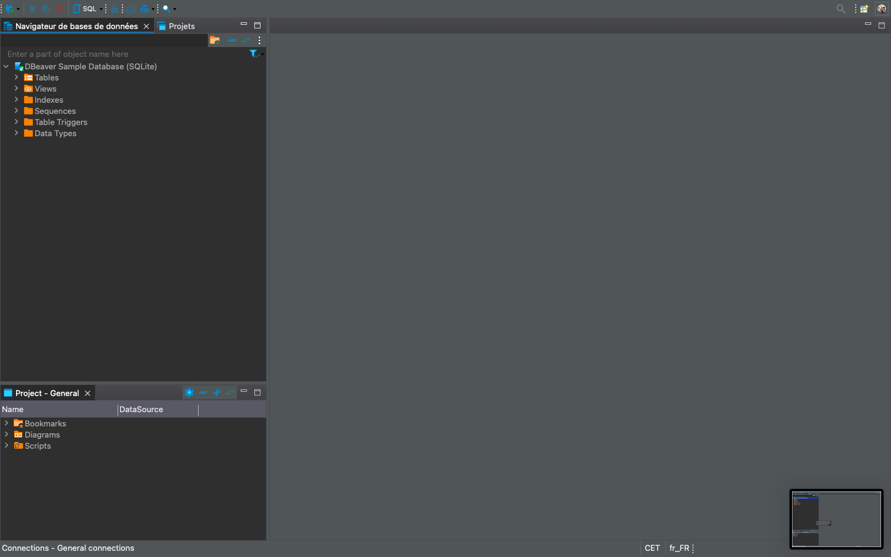


2. **Ouverture de l'onglet "Bases de données"** :
   - Dans la barre latérale de gauche, cliquez sur l'onglet "Bases de données" pour accéder à la vue des bases de données.

3. **Ajout d'une nouvelle connexion** :
   - Dans la vue "Bases de données", faites un clic droit (ou Ctrl + clic) sur "Nouvelle connexion" et sélectionnez "Nouvelle connexion" dans le menu contextuel.

4. **Choix du type de base de données** :
   - Dans la fenêtre de configuration de la connexion, sélectionnez "PostgreSQL" dans la liste des types de bases de données disponibles.

5. **Configuration de la connexion** :
   - Remplissez les informations de connexion à votre base de données PostgreSQL :
     - Nom de la connexion : Donnez un nom à votre connexion (par exemple, "Ma Base de Données PostgreSQL").
     - Hôte : L'adresse IP ou le nom de domaine de votre serveur PostgreSQL (généralement "localhost" soit 127.0.0.1, si la base de données est sur votre Mac).
     - Port : Le numéro de port de votre base de données PostgreSQL (généralement 5432).
     - Nom de la base de données : Le nom de la base de données à laquelle vous souhaitez vous connecter.
     - Nom d'utilisateur : Le nom d'utilisateur PostgreSQL.
     - Mot de passe : Le mot de passe de l'utilisateur PostgreSQL.
   
6. **Test de la connexion** :
   - Cliquez sur le bouton "Tester la connexion" pour vérifier que la configuration est correcte et que DBeaver peut se connecter à votre base de données.

7. **Enregistrement de la connexion** :
   - Si le test de connexion réussit, cliquez sur "Terminer" pour enregistrer la configuration de la connexion.

8. **Accès à la base de données** :
   - Vous pouvez maintenant accéder à votre base de données PostgreSQL en double-cliquant sur la connexion que vous avez créée. DBeaver affichera la structure de votre base de données et vous permettra d'exécuter des requêtes SQL, de gérer des tables, d'importer/exporter des données, etc.

C'est tout ! Vous avez configuré avec succès une connexion à une base de données PostgreSQL dans DBeaver sur votre Mac. Vous pouvez maintenant commencer à travailler avec votre base de données via DBeaver.


<div style="background-color: rgba(128, 128, 128, 0.1); padding: 10px; display: inline-block;">
    📖 C'est tout ! Vous avez configuré avec succès une connexion à une base de données <span style="color: red;">PostgreSQL</span> avec <span style="color: red;">DBeaver</span>sur votre Mac. Vous pouvez maintenant commencer à travailler avec votre base de données via DBeaver.
</div>

<br>

[Cliquez ici pour revenir au sommaire](#table-des-matières)

</details>

---
</details>
 </details>

 [Cliquez ici pour revenir au sommaire](#table-des-matières)

---

<details id="partie-web-cours">
 <summary style="font-size: 25px; font-weight: bold; color: white;">Partie Web : Cours</summary>


### Qu'est-ce qu'une application web ? <a id="quest-ce-quune-application-web-"></a>

<div style="background-color: rgba(128, 128, 128, 0.1); padding: 10px; display: inline-block;">
    📖 Une <span style="color: red;">application web</span> est un logiciel accessible via un navigateur web, éliminant ainsi la nécessité d'une installation locale. Elle permet aux utilisateurs d'interagir avec des fonctionnalités diverses, allant de la gestion de données à la collaboration en temps réel, en exploitant des technologies standard du web telles que HTML, CSS et JavaScript.
</div>

<br>

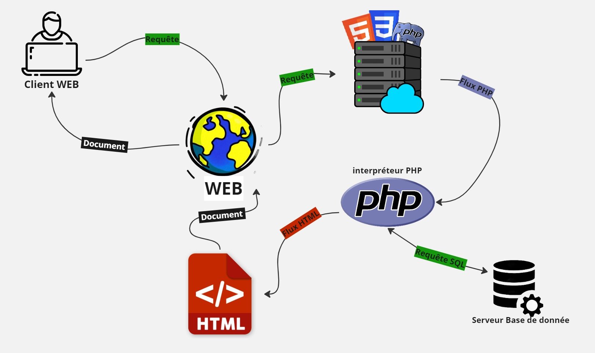

[Cliquez ici pour revenir au sommaire](#table-des-matières)

---
 <details id="définitions">
    <summary style="font-size: 30px; font-weight: bold; color: white;">Définitions</summary>

<br>


 <details id="quel-est-la-différente-entre-le-front-end-et-le-back-end-">
    <summary style="font-size: 20px; font-weight: bold; color: white;">Quel est la différente entre le front-end et le back-end ?</summary>

<br>

 <details id="front-end-côté-client-">
    <summary style="font-size: 18px; font-weight: bold; color: white;">Front-end (côté client) :</summary>
<br>

---
- <p style="font-weight: bold;">Qu'est-ce que c'est ?</p> Le <b>front-end</b> est la partie visible d'une application web avec laquelle l'utilisateur interagit directement. Cela englobe l'interface utilisateur, la conception graphique, les animations et tout ce que l'utilisateur voit et avec quoi il interagit dans le navigateur.
&nbsp;
- <p style="font-weight: bold;">Technologies impliquées :</p> HTML (structure de la page), CSS (styles et mises en forme), JavaScript (interactivité et comportement dynamique). Des bibliothèques et des frameworks comme React, Angular, ou Vue.js sont souvent utilisés pour simplifier le développement front-end
---
</details>


 <details id="back-end-côté-serveur-">
    <summary style="font-size: 18px; font-weight: bold; color: white;">Back-end (côté serveur) :</summary>

<br>

---
- <p style="font-weight: bold;">Qu'est-ce que c'est ?</p> Le back-end est la partie invisible d'une application web qui gère les fonctionnalités en coulisses. Cela inclut la gestion des bases de données, la logique métier, l'authentification des utilisateurs, et la gestion des requêtes provenant du front-end.
&nbsp;
- <p style="font-weight: bold;">Technologies impliquées :</p>Plusieurs langages de programmation peuvent être utilisés, tels que Node.js, Python (avec Django ou Flask), Ruby (avec Ruby on Rails), PHP, Java, etc. Des bases de données comme MySQL, PostgreSQL, MongoDB sont également souvent utilisées pour stocker et récupérer des données.
 </details>

---
 <br>

 <div style="background-color: rgba(128, 128, 128, 0.1); padding: 10px; display: inline-block;">
    📖 En résumé, le <span style="color: red;">front-end</span> se concentre sur ce que voit et ressent l'utilisateur, tandis que le <span style="color: red;">back-end</span> gère les coulisses et assure que l'application fonctionne correctement en traitant les données, en gérant la sécurité et en exécutant la logique métier. Dans de nombreuses applications, le front-end et le back-end communiquent entre eux pour offrir une expérience utilisateur complète.
</div>

---
</details>

[Cliquez ici pour revenir au sommaire](#table-des-matières)


### Qu'est-ce qu'une URL ? <a id="quest-ce-quune-url-"></a>

<div style="background-color: rgba(128, 128, 128, 0.1); padding: 10px; display: inline-block;">
    📖 Une <span style="color: red;">U</span>niform <span style="color: red;">R</span>esource <span style="color: red;">L</span>ocator, est une adresse utilisée pour localiser des ressources sur Internet. Elle est composée de plusieurs éléments, notamment le protocole (comme "http" ou "https"), le nom de domaine (par exemple, www.example.com), le chemin d'accès au fichier, et éventuellement des paramètres de requête. Les URL permettent aux navigateurs web et autres clients HTTP de localiser et d'accéder à des pages web, des fichiers, des images ou d'autres ressources en ligne. Elles jouent un rôle fondamental dans la navigation sur le Web en permettant l'identification unique et l'accès aux divers contenus disponibles en ligne.
</div>


### Qu'est-ce que le PHP ? <a id="quest-ce-que-php-"></a>

 <div style="background-color: rgba(128, 128, 128, 0.1); padding: 10px; display: inline-block;">
    📖 Le <span style="color: red;">PHP (Hypertext Preprocessor)</span> est un langage de programmation côté serveur utilisé pour le développement web dynamique. Il s'intègre facilement avec le HTML et est largement utilisé pour créer des sites web interactifs. PHP est open source, facile à apprendre et supporte diverses bases de données. Malgré certaines critiques, il reste un choix populaire pour le développement web.
</div>


### Qu'est-ce que le HTML ? <a id="quest-ce-que-html-"></a>

 <div style="background-color: rgba(128, 128, 128, 0.1); padding: 10px; display: inline-block;">
    📖 Le <span style="color: red;">HTML (HyperText Markup Language) </span> est un langage de balisage utilisé pour structurer le contenu des pages web. Il définit la structure et les éléments d'une page, tels que les titres, les paragraphes, les liens, etc. 
</div>

### Qu'est-ce que le CSS ? <a id="quest-ce-que-css-"></a>

 <div style="background-color: rgba(128, 128, 128, 0.1); padding: 10px; display: inline-block;">
    📖 Le <span style="color: red;">CSS</span> est un langage de feuilles de style utilisé pour contrôler la présentation et l'apparence du contenu HTML. Ensemble, HTML et CSS forment la base du développement web en permettant de créer des pages web bien structurées et esthétiquement conçues.
   

### Qu'est-ce que Apache ? <a id="quest-ce-que-apache-"></a>

<div style="background-color: rgba(128, 128, 128, 0.1); padding: 10px; display: inline-block;">
    📖 <span style="color: red;">Apache</span> est un serveur web open source très répandu, prisé pour son adaptabilité et sa sécurité. Il offre une flexibilité considérable, permettant aux administrateurs de personnaliser les fonctionnalités en fonction de leurs besoins. Sa réputation repose sur sa performance, et il est largement utilisé à l'échelle mondiale pour héberger des sites web. Grâce à son architecture modulaire et son code source ouvert, Apache facilite la collaboration et l'évolution constante.
</div>


### Qu'est-ce que PhpMyAdmin ? <a id="quest-ce-que-phpmyadmin-"></a>

<div style="background-color: rgba(128, 128, 128, 0.1); padding: 10px; display: inline-block;">
    📖 <span style="color: red;">PhpMyAdmin</span> 
est un outil de gestion de base de données qui offre une interface web conviviale pour administrer MySQL. Il permet aux utilisateurs de visualiser, modifier et gérer les bases de données à travers une interface graphique, éliminant ainsi la nécessité de maîtriser des commandes SQL complexes. Avec PhpMyAdmin, les utilisateurs peuvent effectuer des opérations telles que la création de tables, l'exécution de requêtes, l'importation et l'exportation de données, le tout de manière intuitive. C'est particulièrement utile pour les développeurs et administrateurs de bases de données qui préfèrent une approche visuelle dans la gestion de leurs bases de données MySQL.
</div>

<br>

[Cliquez ici pour revenir au sommaire](#table-des-matières)

</details>


---

<details id="gestion-dune-application-we">
  <summary style="font-size: 30px; font-weight: bold; color: white;">Gestion d'une application web</summary>

---


<details id="installation-de-mamp">
   <summary style="font-size: 25px; font-weight: bold; color: white;">Installation de MAMP</summary>

## Qu'est-ce que MAMP ? <a id="quest-ce-que-mamp-"></a>


### Installation de MAMP <a id="installation-de-mamp-"></a>

Pour installer MAMP sur votre Mac, vous devrez suivre ces étapes :

1 - Ouvrez votre navigateur :
- Cliquer sur cette url juste [ici](https://www.mamp.info/en/mamp-pro/mac/)

2 - Télécharger la version :
- Pour ma part, je téléchargerai la version Mac (intel).

3 - Ouverture du .pkg :
- Suivre les instructions comme une installation classique.

4 - Installation 

```sh
/Applications/MAMP/bin/mamp
```

4 - Les répétoires important de MAMP

- Les répertoires importants de MAMP sont au nombre de six :

- /bin : répertoire contenant les exécutables d'Apache, PHP4, PHP5, MySQL5 et SQLite.
- /conf : répertoire contenant les fichiers de configuration d'Apache (httpd.conf), PHP (php.ini) et SQLiteManager (config.db).
- /tmp : répertoire contenant les fichiers temporaires créés par les exécutables. Le répertoire /tmp/php contient notamment les fichiers temporaires des sessions PHP.
- /db : répertoire contenant les bases de données SQLite et MySQL5.
- /logs : répertoire contenant les fichiers de logs d'erreurs de PHP, Apache et MySQL.
- /htdocs : répertoire contenant les différents projets de sites Web.
Ce dernier nous intéresse tout particulièrement car c'est dans celui-ci que nous déposerons nos sites Internet.

<div style="background-color: rgba(128, 128, 128, 0.1); padding: 10px; display: inline-block;">
    📖 C'est tout vous avez désormais<span style="color: red;"> MAMP</span> d'installer, nous allons passer au déploiement d' <span style="color: red;">Apache</span> et de <span style="color: red;">PhpMyAdmin</span> !
</div>

</details>

<br>

[Cliquez ici pour revenir au sommaire](#table-des-matières)

<details id="configuration-de-mamp">
   <summary style="font-size: 25px; font-weight: bold; color: white;">Configuration de MAMP</summary>

<br>

### Lancer MAMP Pro, vous devriez arrivez sur cette interface. <a id="lancer-mamp-pro-vous-devriez-arrivez-sur-cette-interface"></a>

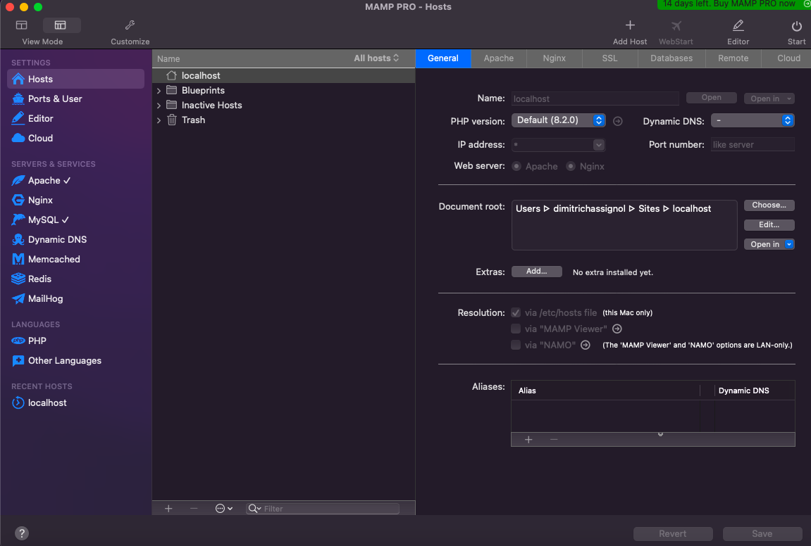

1 - Importer son projet
- Document root: Cliquez sur "Open In" puis "Finder" et ensuite importer votre projet dans ce répétoire. 

2 - Lancer le serveur
- Cliquez sur "Start" en haut à droite et cliquez sur "WebStart" et voilà !

</details>

[Cliquez ici pour revenir au sommaire](#table-des-matières)

<details id="configuration-de-phpmyadmin">
   <summary style="font-size: 25px; font-weight: bold; color: white;">Configuration de PhpMyAdmin</summary>

<br>

PhpMyAdmin est un outil de gestion de base de données MySQL largement utilisé. Pour assurer son bon fonctionnement, une configuration appropriée est essentielle. Suivez ces étapes pour configurer PhpMyAdmin selon vos besoins.

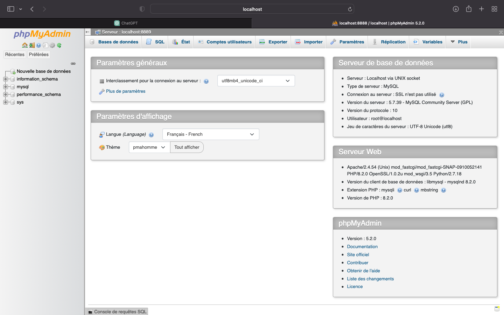

## Étape 1 : Installation de PhpMyAdmin <a id="étape-1-installation-de-phpmyadmin"></a>

Grâce à MAMP, PhpMyAdmin est automatiquement installé, vous pouvez y aller en allant sur cette url : localhost:8888/phpMyAdmin5/

```sh
/Applications/MAMP/bin/phpMyAdmin5
```

## Étape 2 : Qu'est-ce qu'on peut faire ? <a id="étape-2-quest-ce-quon-peut-faire-"></a>

Une fois que vous êtes sur l'interface de PhpMyAdmin, vous avez accès à une gamme d'outils pour gérer votre base de données MySQL. Voici quelques actions courantes que vous pouvez effectuer :

<br>

1. Sélectionner une base de données :
À gauche, vous verrez la liste des bases de données. Cliquez sur le nom de la base de données que vous souhaitez utiliser.

<br>

2. Gérer les tables :
Une fois dans une base de données, vous verrez la liste des tables. Vous pouvez effectuer des actions telles que la création, la modification ou la suppression de tables.

<br>

3. Exécuter des requêtes SQL :
Utilisez l'onglet "SQL" pour exécuter des requêtes SQL directement. C'est utile pour effectuer des opérations complexes ou spécifiques.

<br>

4. Importer/Exporter des données :
Vous pouvez importer ou exporter des bases de données ou des tables complètes. Cela peut être fait via les onglets "Importer" et "Exporter".

<br>

5. Gérer les utilisateurs :
L'onglet "Utilisateurs" vous permet de gérer les utilisateurs MySQL, leurs privilèges et leurs mots de passe.

<br>

6. Optimiser et réparer les tables :
Vous pouvez optimiser et réparer les tables pour améliorer les performances de la base de données. Cela se fait via l'onglet "Opérations".

<br>

7. Afficher les statistiques :
L'onglet "Statistiques" fournit des informations sur l'utilisation de la base de données, la taille des tables, etc.

<br>

8. Configurer les paramètres :
Dans l'onglet "Paramètres", vous pouvez configurer certaines options de PhpMyAdmin.

<br>

9. Déconnexion :
N'oubliez pas de vous déconnecter une fois que vous avez terminé vos opérations, surtout si vous travaillez sur un serveur partagé.
Conseils supplémentaires :
Documentation : N'hésitez pas à consulter la documentation officielle de PhpMyAdmin pour des informations plus détaillées et des tutoriels.
Prudence avec les opérations : Faites preuve de prudence lors de l'exécution de commandes SQL, surtout si elles modifient ou suppriment des données.
Sauvegardes : Avant d'apporter des modifications importantes, assurez-vous d'avoir des sauvegardes de vos bases de données.
Cela devrait vous donner un bon point de départ pour explorer et utiliser PhpMyAdmin.
</details>

[Cliquez ici pour revenir au sommaire](#table-des-matières)

</details>

---

</details>

[Cliquez ici pour revenir au sommaire](#table-des-matières)
 </details>

---

<details id="partie-sql-avec-dbeaver-tp2">
 <summary style="font-size: 25px; font-weight: bold; color: white;">Partie SQL avec DBeaver : TP1</summary>


<br>

# Fait le le 24/11/2023 <a id="partie-sql-avec-dbeaver-tp2"></a>

Veuillez répondre aux questions suivantes dans un fichier Word et rendre une copie de ce fichier avec votre TP.

1. **Donnez un exemple d’ordre SQL de création de table.**
    ```sql
    -- Création d'une table "Employees" avec plusieurs colonnes
    CREATE TABLE Employees (
        EmployeeID int,         -- Identifiant de l'employé (entier)
        LastName varchar(255),  -- Nom de famille de l'employé (chaîne de caractères, 255 caractères max)
        FirstName varchar(255), -- Prénom de l'employé (chaîne de caractères, 255 caractères max)
        Address varchar(255),   -- Adresse de l'employé (chaîne de caractères, 255 caractères max)
        City varchar(255)       -- Ville de l'employé (chaîne de caractères, 255 caractères max)
    );
    ```

2. **Donner un exemple d’ordre SQL de type INSERT, DELETE, UPDATE.**
    ```sql
    -- Exemple d'INSERT : Ajout d'un nouvel employé
    INSERT INTO Employees (EmployeeID, LastName, FirstName, Address, City)
    VALUES (1, 'Doe', 'John', '123 Main St', 'Anytown');

    -- Exemple de DELETE : Suppression de l'employé avec l'ID 1
    DELETE FROM Employees
    WHERE EmployeeID = 1;

    -- Exemple d'UPDATE : Modification de la ville de l'employé avec l'ID 1
    UPDATE Employees
    SET City = 'Newtown'
    WHERE EmployeeID = 1;
    ```

3. **Donnez un exemple d’ordre SQL de création table qui contient également l’ordre de création d’une clé étrangère.**
    ```sql
    -- Création de la table "Orders" avec une clé étrangère liée à la table "Persons"
    CREATE TABLE Orders (
        OrderID int,            -- Identifiant de la commande (entier)
        OrderNumber int,        -- Numéro de commande (entier)
        PersonID int,           -- Identifiant de la personne liée à la commande (entier)
        PRIMARY KEY (OrderID),  -- Définition de la clé primaire sur OrderID
        FOREIGN KEY (PersonID) REFERENCES Persons(PersonID)  -- Définition de la clé étrangère liée à Persons(PersonID)
    );
    ```

4. **Donner un exemple de suppression d’une colonne d’une table à l’aide d’un ordre SQL de type ALTER TABLE.**
    ```sql
    -- Suppression de la colonne "Address" de la table "Employees"
    ALTER TABLE Employees
    DROP COLUMN Address;
    ```

5. **Donner un exemple d’ajout d’une colonne d’une table à l’aide d’un ordre SQL de type ALTER TABLE.**
    ```sql
    -- Ajout de la colonne "ZipCode" à la table "Employees"
    ALTER TABLE Employees
    ADD COLUMN ZipCode varchar(10);
    ```

6. **Donner un exemple de destruction de clé étrangère à l’aide d’un ordre SQL de type ALTER TABLE.**
    ```sql
    -- Suppression de la clé étrangère liée à "PersonID" dans la table "Orders"
    ALTER TABLE Orders
    DROP FOREIGN KEY PersonID;
    ```

7. **Donner un exemple de création de clé étrangère à l’aide d’un ordre SQL de type ALTER TABLE.**
    ```sql
    -- Création d'une nouvelle clé étrangère liée à "PersonID" dans la table "Orders"
    ALTER TABLE Orders
    ADD FOREIGN KEY (PersonID) REFERENCES Persons(PersonID);
    ```

 </details>

[Cliquez ici pour revenir au sommaire](#table-des-matières)

---


<details id="partie-sql-avec-dbeaver-tp1suite">
 <summary style="font-size: 25px; font-weight: bold; color: white;">Partie SQL avec DBeaver : TP1 (suite)</summary>


<br>

# Fait le le 08/01/2024 <a id="partie-sql-avec-dbeaver-tp1suite"></a>


Veuillez répondre aux questions suivantes dans un fichier Word et rendre une copie de ce fichier avec votre TP. Les réponses sont basées sur la database du <a href="./SQL/TP1/question1.sql">TP1</a>.

**Objectifs :** 
Tester différents types d’ordre SQL

1. **Liste des camions triés par NoImmatriculation**
    ```sql
    -- Création d'une table "Employees" avec plusieurs colonnes
    SELECT "nom_propriétaire", no_immat
    FROM public.camion
    ORDER BY no_immat;
    ```
    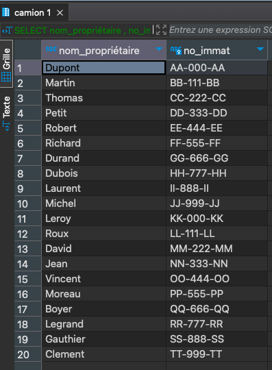

2. **Liste des types de déchets triés par libellé**
    ```sql
    SELECT code_type, libelle_type
    FROM public.type_dechets
    ORDER BY libelle_type;
    ```
    

3. **Liste des types de déchets transportables par camion (NoImmatriculation, NomPropriétaire, LibelléType)**
    ```sql
    SELECT c.no_immat, c."nom_propriétaire", td.libelle_type
    FROM public.camion c
    JOIN public.limitation l ON c.no_immat = l.no_immat
    JOIN public.type_dechets td ON l.code_type = td.code_type;
    ```
    

4. **Liste des camions (NoImmatriculation, NomPropriétaire) qui peuvent transporter du verre**
    ```sql
    SELECT c.no_immat, c."nom_propriétaire"
    FROM public.camion c
    JOIN public.limitation l ON c.no_immat = l.no_immat
    JOIN public.type_dechets td ON l.code_type = td.code_type
    WHERE td.libelle_type = 'Verre';
    ```
    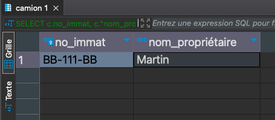

5. **Liste des pesées (CodeBordereauPesée, DatePesée) pour le propriétaire qui a pour nom David**
    ```sql
    SELECT p.code_bordereau_pesee, p.date_pesee
    FROM public.pesee p
    JOIN public.camion c ON p.no_immat = c.no_immat
    WHERE c.nom_proprietaire = 'David';
    ```
    

6. **Le nombre de pesées au cours de l’année 2017**
    ```sql
    SELECT COUNT(*) AS nombre_de_pesees_2017
    FROM public.pesee
    WHERE EXTRACT(YEAR FROM date_pesee) = 2017;
    ```
    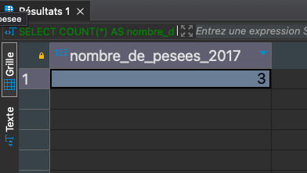

7. **Le poids d’arrivée maximum au cours de l’année 2017**
    ```sql
    SELECT MAX("poids_arrivée") AS poids_max_arrivée
    FROM public.pesee
    WHERE EXTRACT(YEAR FROM date_pesee) = 2017;
    ```
    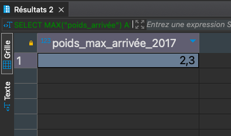

8. **Liste des camions (NoImmatriculation, NomPropriétaire) dont le poids d’arrivée était supérieur à 19T**
    ```sql
    SELECT c.no_immat AS NoImmatriculation, c.nom_propriétaire AS NomProprietaire
    FROM public.camion c
    JOIN public.pesee p ON c.no_immat = p.no_immat
    WHERE P.poids_arrivée > 19;
    ```
    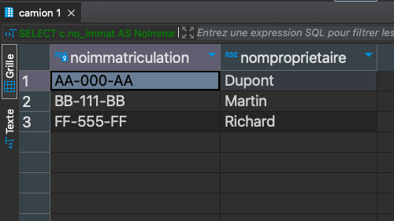

9. **Poids total de 'Papiers-cartons' déposé par le syndicat SOLUTRI**
    ```sql
    SELECT SUM(p.poids_arrivée) AS Poids_Total_Papiers_Cartons
    FROM public.pesee p
    JOIN public.type_dechets td ON p.code_type = td.code_type
    JOIN public.syndicat s ON p.code_syndicat = s.code_syndicat
    WHERE td.libelle_type = 'Cartons' AND s.nom_syndicat = 'Syndicat5';
    ```
    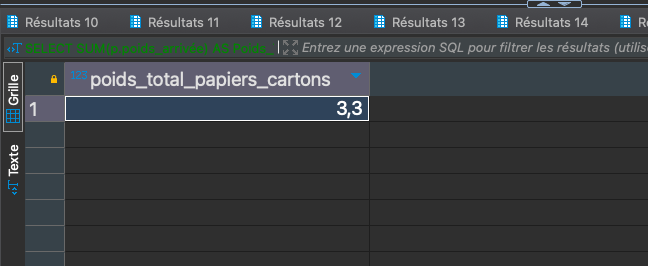

10. **Différents syndicats (nom et adresse) qui ont déposé du verre, triés par ordre alphabétique sur le nom de syndicat**
    ```sql
    SELECT DISTINCT s.nom_syndicat, s.adresse_syndicat
    FROM public.pesee p
    JOIN public.syndicat s ON p.code_syndicat = s.code_syndicat
    JOIN public.type_dechets td ON p.code_type = td.code_type
    WHERE td.libelle_type = 'Verre'
    ORDER BY s.nom_syndicat;
    ```
    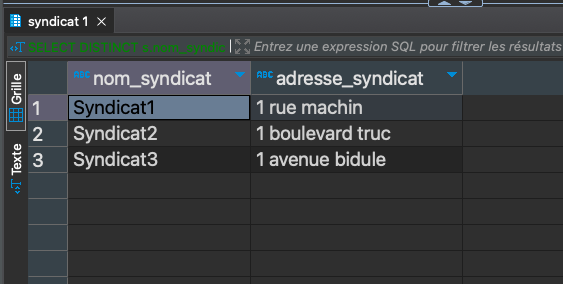


11. **Poids total de déchets déposé par syndicat et par type de déchet**
    ```sql
    SELECT s.nom_syndicat, td.libelle_type, SUM("poids_arrivée") AS poids_total
    FROM public.pesee p
    JOIN public.syndicat s ON p.code_syndicat = s.code_syndicat
    JOIN public.type_dechets td ON p.code_type = td.code_type
    GROUP BY s.nom_syndicat, td.libelle_type
    ORDER BY s.nom_syndicat, td.libelle_type;
    ```
    

12. **Liste des types de déchets (LibelléType) qui n’ont jamais été pesés**

    ```sql
    SELECT libelle_type
    FROM public.type_dechets
    WHERE code_type NOT IN (SELECT code_type FROM public.pesee);
    ```
    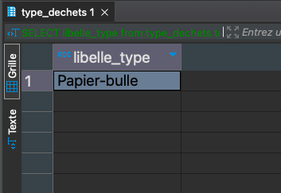


 </details>

[Cliquez ici pour revenir au sommaire](#table-des-matières)

---


